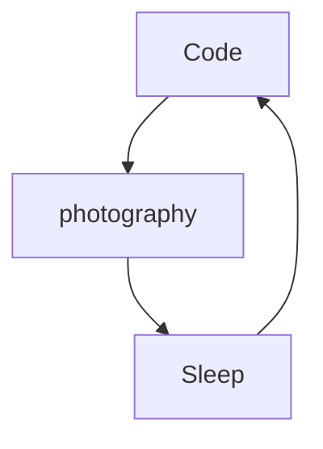

# Tristab Web

I'm Tristan from France, living in France, Front-end developper and Wordpress Former, I create websites and I train people on wordpress.

<!---
TristanbWeb/TristanbWeb is a ✨ special ✨ repository because its `README.md` (this file) appears on your GitHub profile.
You can click the Preview link to take a look at your changes.
--->

Actually:

- 🔭 I’m currently working on a new Website ...
- 🌱 I’m currently learning amazing things ...
- 👯 I help people to be programmers and feelancers ...
- ⚡ Fun fact : I'am Photographer, hiker ...
- 📫 How to reach me: Linkedin or email

## My Banner

 <strong>
    Creation of a website
  </strong>

  

### Connect with me:

&nbsp;&nbsp;

&nbsp;&nbsp;

### Languages and Tools:

 
 

### My daily routine :

### ⭐ GitHub Stats

[courses]: https://formations.mikecodeur.com
[website]: https://go.mikecodeur.com/blog
[insta]: https://go.mikecodeur.com/instagram
[youtube]: https://go.mikecodeur.com/youtube
[youtubeplaylist]: https://www.youtube.com/channel/UC7BNBNLwMF8GjgXLDP8PWQw
